# 進捗報告
## やったこと
- 実験結果の分析
    - アルゴリズム毎に,問題を変えると性能がどうなるか比較
    
        アルゴリズム：moead, nsgaii, nsgaiii, smpso, spea2  
        評価指標：GDX, IGDX, HV  
        skewMED p : [2,2], [2,1], [2,0.5], [1,1], [1,0.5], [0.5,0.5]

実験結果のplot

  

moead GDX
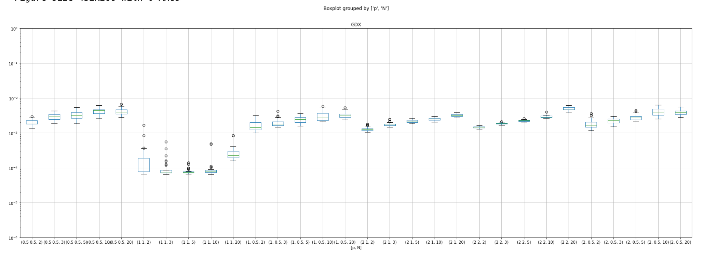
moead IGDX
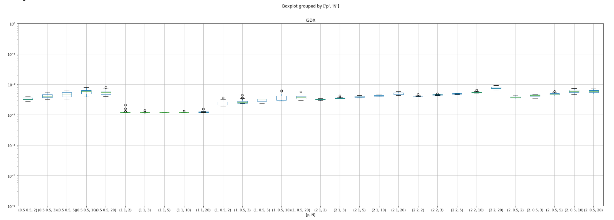
moead HV
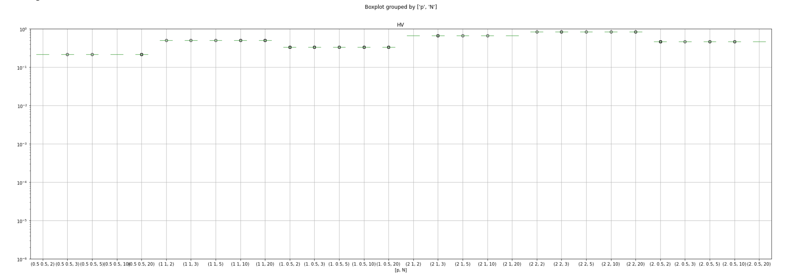
nsgaii GDX
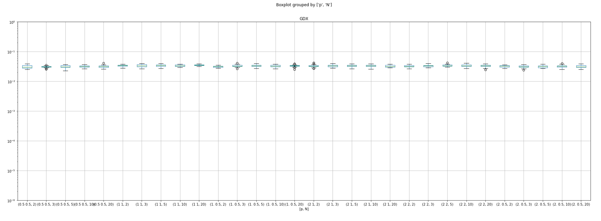
nsgaii IGDX
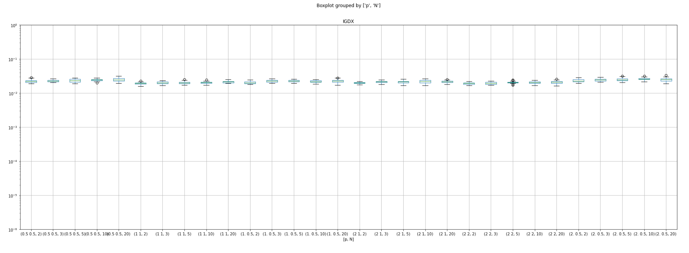
nsgaii HV
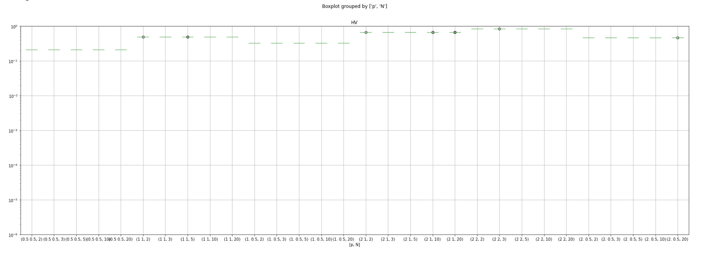
nsgaiii GDX
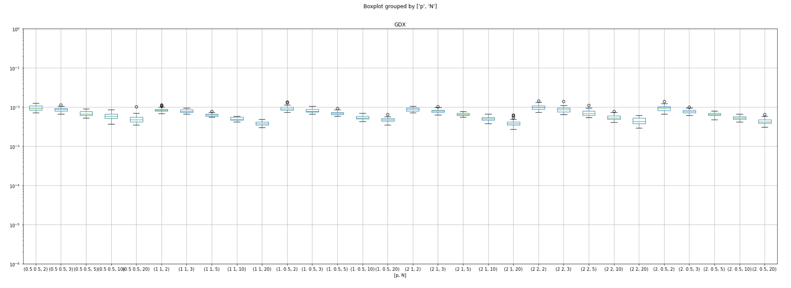
nsgaiii IGDX
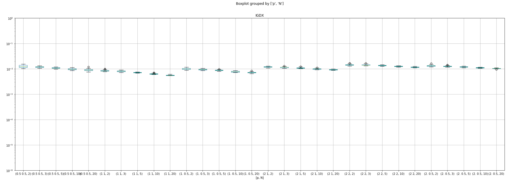
nsgaiii HV
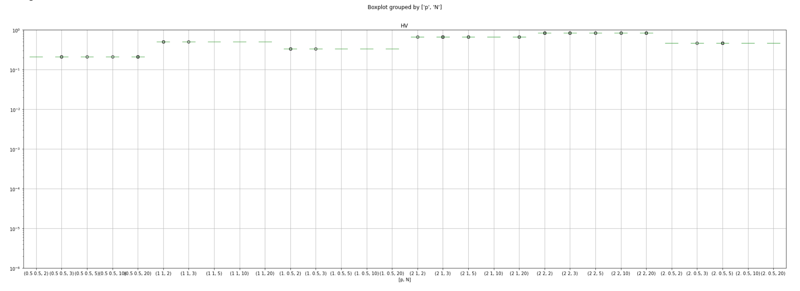
smpso GDX
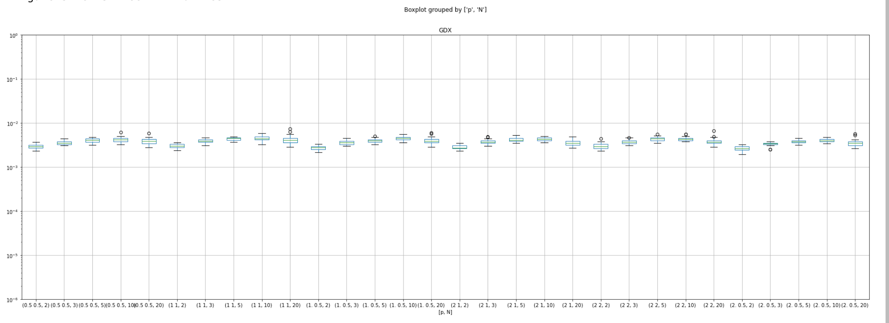
smpso IGDX
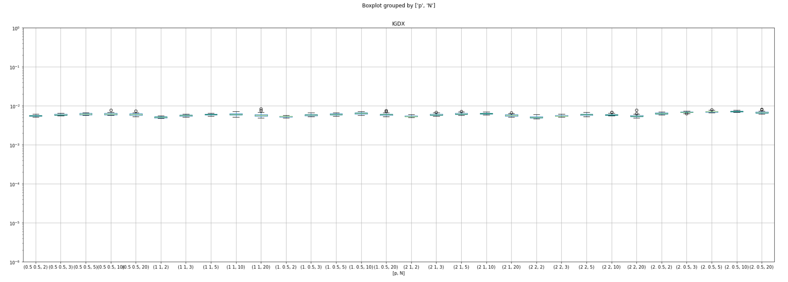
smpso HV
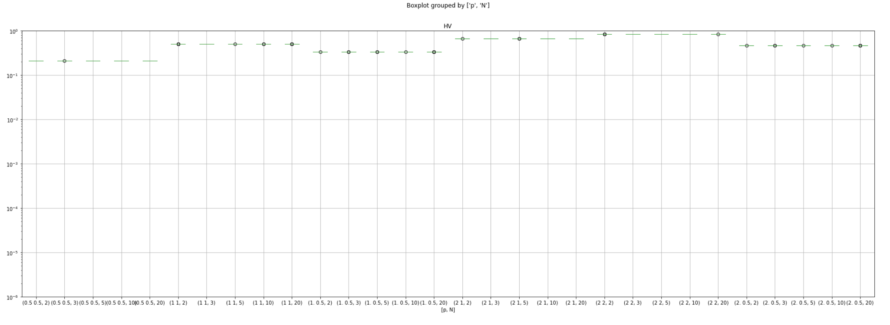
spea2 GDX
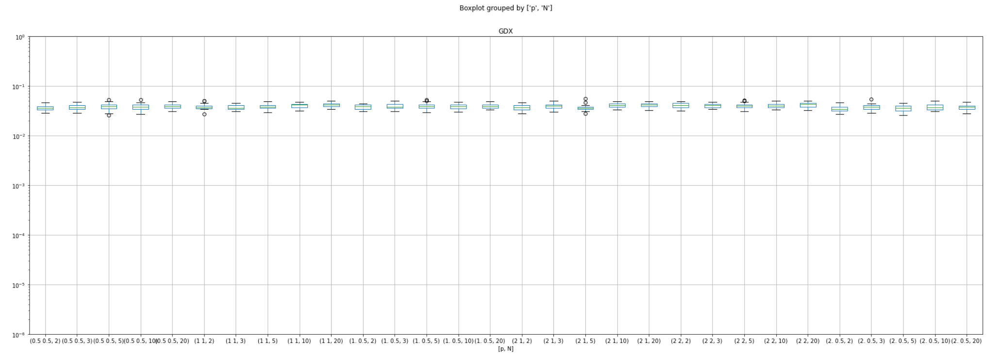
spea2 IGDX
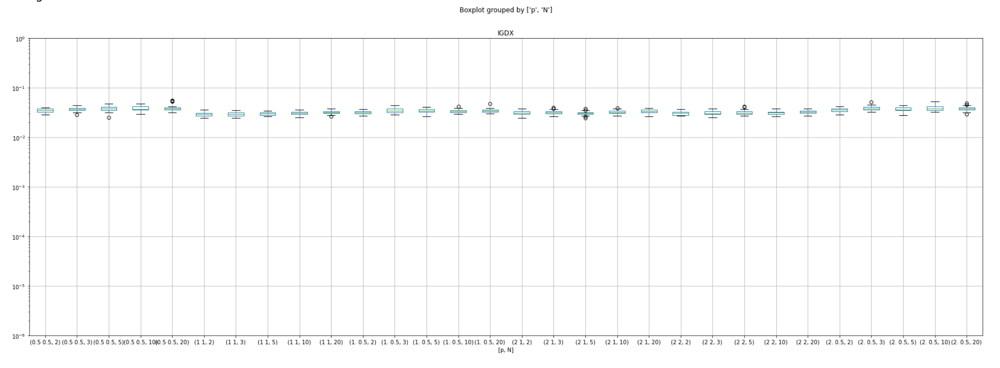
spea2 HV

　　

     実験結果  
    　精度があまり良くなかったのでアーカイブを追加して実験をこれから回し直す

## これからやること
- アーカイブの追加, 非劣解集合の抜き出し, アーカイブを評価回数で区切って実験結果を計算する関数の実装
    - イテレーションごとの評価が取りたいので, アーカイブを追加することで非劣解集合のみで評価ができるようにする