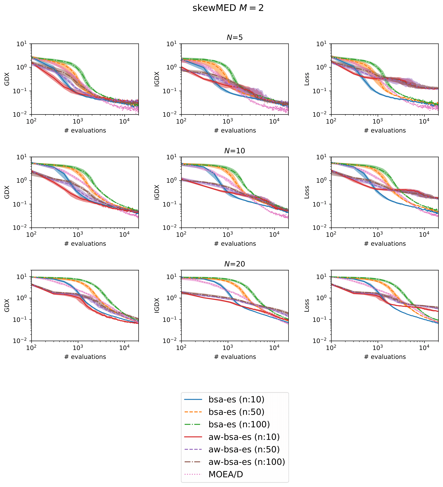
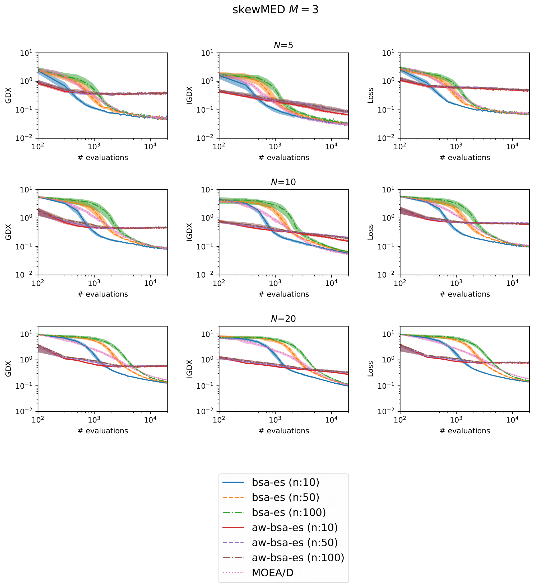
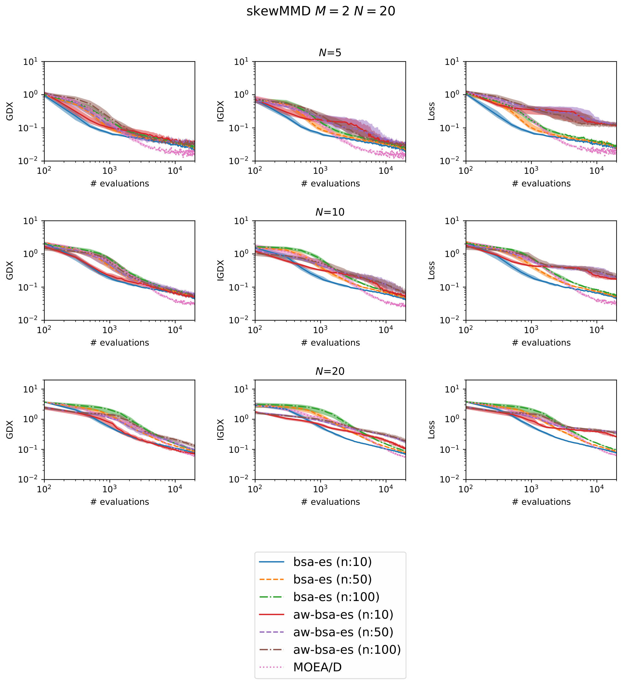
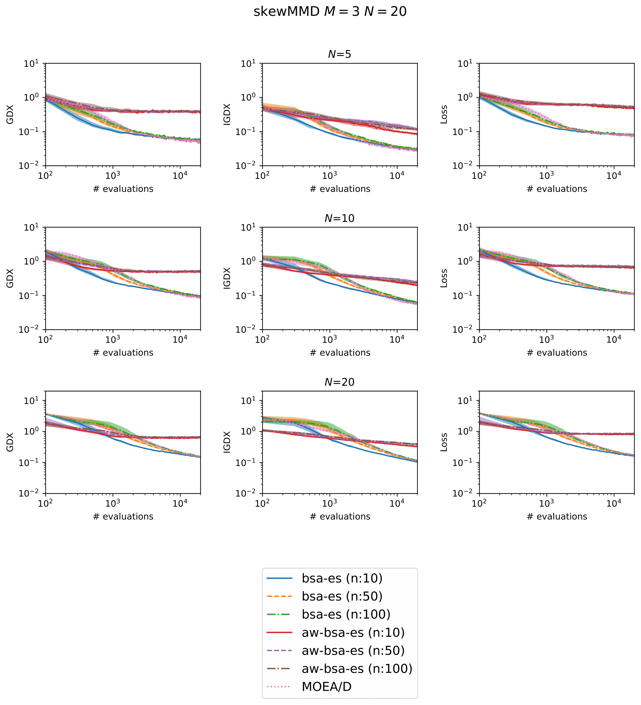
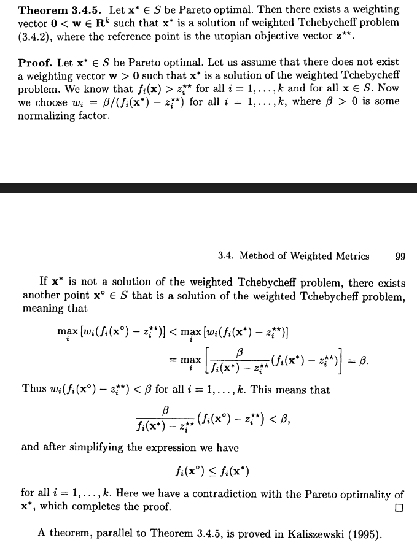

# 進捗報告
## 行っていること
以下に示すアルゴリズムに関して実験を回し、その性能調査を行なっています。

## 実験結果

## 考察
- step-sizeが重みベクトルごとに用意されていないと探索が上手くいかない？
    - 重み→step-sizeのような関数があるとうまくいく？
- M=3 のときに上手くいかないのは一様分布の生成の問題？
    - 目的数が増えると一様に生成するのが難しい？

### アルゴリズムの概要
- ベジエ単体bの制御点の初期化
- while 終了条件まで繰り返す
    - weight_set を random に n 個生成
    - X = [b(weight) for weight in weight_set]
    - f(X) を計算
    - X' = X + sigma
    - f(X') を計算
    - スカラー化関数の平均が小さかったら探索を成功としてstep-size を大きくする．
    - archive に f(X) と f(X') を追加
    - archive に対して non-dominated-sort をして，Bとする
    - weight を計算
    - B にベジエ単体のフィティング

 

## 今後やること
- ROUTE 発表会に向けてスライドの作成