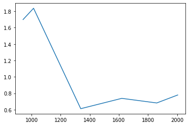
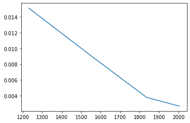
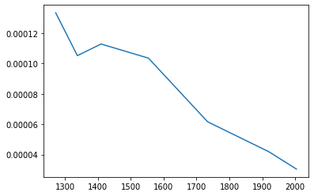
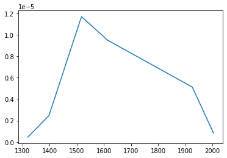
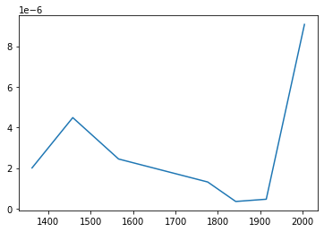
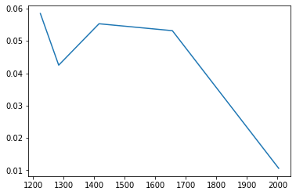
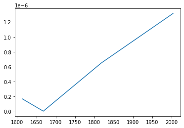
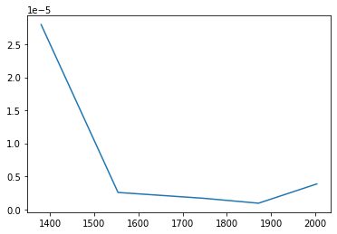

# 進捗報告

## やったこと
- 行った実験について, グラフを作成しています.

## 実験設定
* 評価関数：SMD1~SMD8
* 評価回数：2000回
* モード(none, mean, sigma, cov)
    * mean：平均ベクトルの初期値を回帰モデルの予測値で与える  
    * sigma：標準偏差の初期値を回帰モデルの予測の標準偏差で与える  
    * cov：共分散行列の初期値を回帰モデルの予測の共分散で与える

## 実験結果(noneのみ)
* SMD1

* SMD2

* SMD3

* SMD4

* SMD5

* SMD6

* SMD7

* SMD8

## 実験結果
* 実験結果は評価関数によってまちまち
* SMD1, SMD2, SMD3, SMD6, SMD8 などでは, 試行回数を増やしていくと性能が良くなっている
* SMD5, SMD7 などでは, 試行回数を増やしていくとあるところから性能が悪くなっている

## これからやること
* 実験結果の考察
* 他のモードでのグラフ生成
